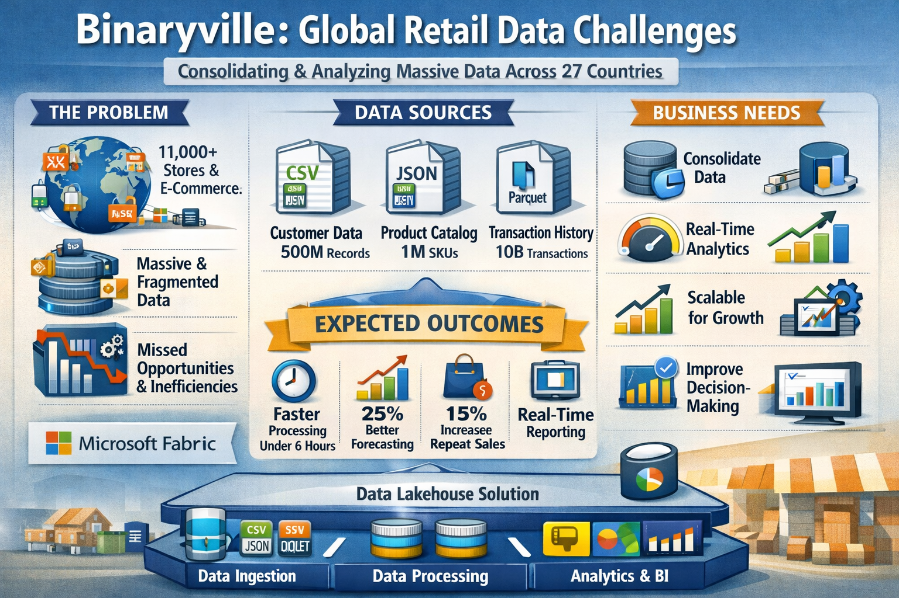
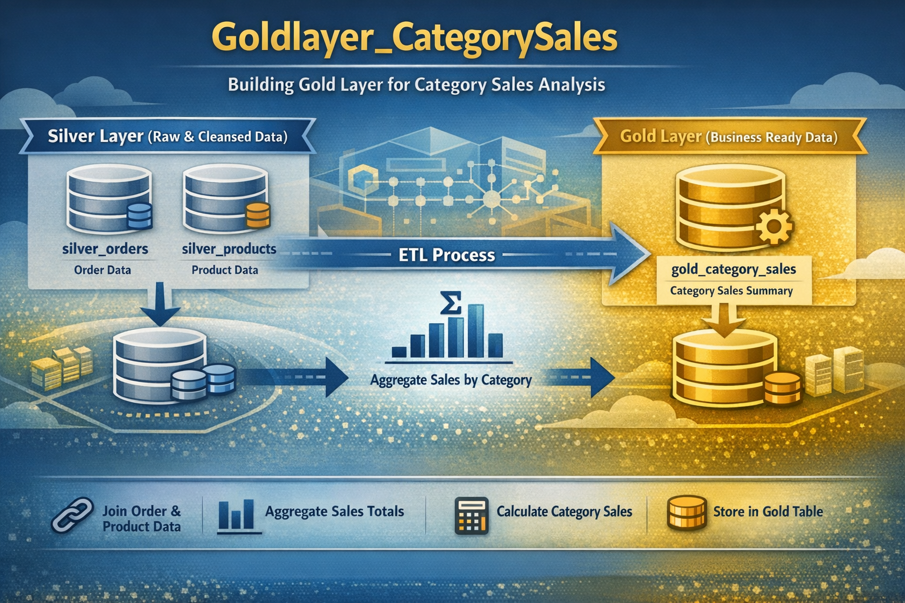

# Global Retail Lakehouse on Microsoft Fabric

## Architecture Overview

## Overview

Binaryville is a multinational retailer operating in 27 countries, with over 11,000 stores and a strong e-commerce presence. The company generates massive volumes of data daily but struggles to consolidate and analyze it efficiently.

Fragmented systems, inconsistent schemas, and poor historical data quality have led to slow reporting cycles and limited visibility across the business. As a result, decision-making is delayed and operational inefficiencies persist.

This project designs a scalable lakehouse architecture using Microsoft Fabric to unify data across regions and enable faster, more reliable analytics.

---

## Business Objectives

The solution is designed to:

- Consolidate data from in-store and online systems across multiple countries  
- Process large volumes of historical and daily transactional data  
- Enable consistent, company-wide analytics  
- Support scalability for future growth and acquisitions  

---

## Data Sources

The platform integrates three primary data domains:

### Customer Data
- Format: CSV  
- Source: CRM system  
- Volume: ~500 million records  
- Frequency: Daily  

### Product Catalog
- Format: JSON  
- Source: Inventory management system  
- Volume: ~1 million SKUs  

### Transaction History
- Format: Parquet  
- Source: POS and e-commerce systems  
- Volume: ~10 billion transactions annually  

---

## Expected Outcomes

- Reduce data processing time from 72 hours to under 6 hours  
- Improve inventory forecasting accuracy by 25%  
- Increase repeat purchases by 15% through better personalization  
- Enable near real-time financial reporting across regions  

---

## Key Challenges

- Inconsistent schemas across regions and acquired systems  
- Poor data quality in historical datasets  
- Handling 5 years of historical data alongside daily ingestion  
- Complex transformations due to currency, time zone, and product differences  
- Maintaining reporting continuity during implementation  

---

## Solution Architecture

The solution follows a Medallion (Bronze, Silver, Gold) lakehouse architecture implemented in Microsoft Fabric.

---

### Bronze Layer — Raw Ingestion

The Bronze layer stores raw data exactly as received from source systems.

**Key Design Decisions:**

- Automated ingestion using Fabric Pipelines  
- Support for CSV, JSON, and Parquet formats  
- Metadata-driven ingestion (source, region, load date)  
- Separation of historical backfill and incremental loads  

This layer ensures traceability and allows full data replay when needed.

---

### Silver Layer — Data Cleansing and Standardization

The Silver layer transforms raw data into clean, standardized datasets.

**Core Transformations:**

- Data quality checks (nulls, duplicates, invalid values)  
- Schema standardization across regions  
- Currency normalization into a common reporting currency  
- Time zone alignment (UTC + local attributes)  
- Product code mapping to global standards  
- Customer identity unification  

**Technology Choices:**

- Fabric Dataflows for rule-based transformations  
- Spark for large-scale distributed processing  
- Delta tables for ACID transactions and schema evolution  

---

### Gold Layer — Business-Ready Data Models

The Gold layer provides curated datasets for analytics and reporting.

**Data Models Include:**

- Sales and revenue analytics  
- Inventory and supply chain metrics  
- Financial reporting datasets  
- Customer segmentation and behavior analysis  
- Product performance across regions  

These datasets are optimized for Power BI and business consumption.

---

## Processing Strategy

To handle scale efficiently, the system uses incremental processing instead of full reloads.

**Approach:**

- Historical data loaded in controlled backfill phases  
- Daily pipelines process only new and changed data  
- Partitioning by date and region for large transaction tables  
- Incremental merge (upsert) logic using Delta Lake  
- Spark used selectively for high-volume transformations  

This reduces compute cost and improves pipeline performance.

---

## Analytics and Reporting

Power BI is integrated with the Gold layer to provide:

- Executive dashboards for financial performance  
- Sales and regional performance tracking  
- Inventory monitoring and forecasting insights  
- Customer behavior and personalization analytics  

The system supports near real-time visibility across business units.

---

## Why Microsoft Fabric

Microsoft Fabric was selected to reduce architectural complexity and improve integration.

Instead of managing separate tools for ingestion, storage, transformation, and reporting, Fabric provides a unified environment. This simplifies governance, reduces operational overhead, and improves collaboration between data engineering and business teams.

---

## Business Impact

The architecture enables:

- Faster data availability for decision-making  
- Improved data consistency across regions  
- Scalable infrastructure for future growth  
- Better forecasting and personalization capabilities  

This shifts the data platform from static reporting to a system that actively supports business operations.

---

## Summary

This project demonstrates how a modern lakehouse architecture can solve real-world data fragmentation at scale.

By combining structured ingestion, robust data standardization, and business-focused modeling, the platform transforms disconnected global data into a unified, actionable asset.
